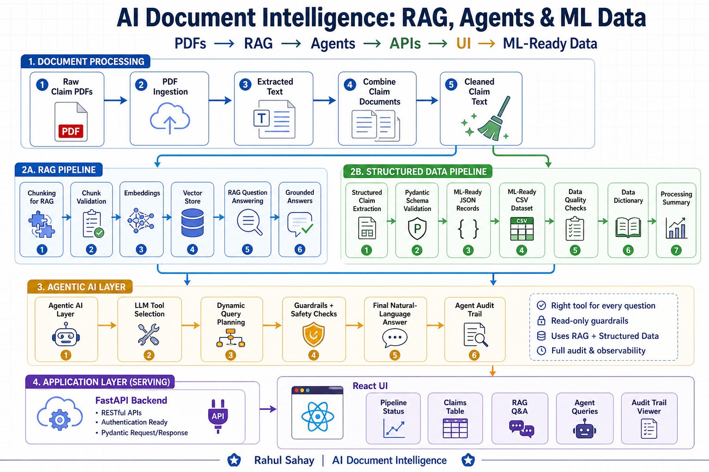
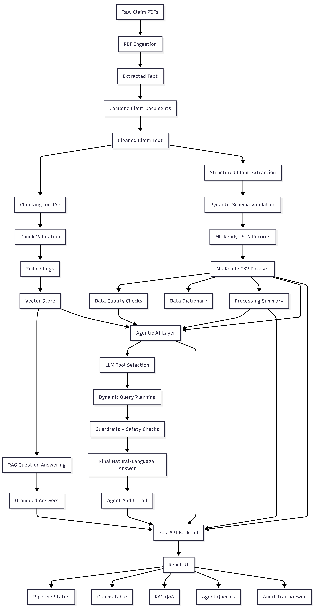

# AI Document Intelligence: RAG, Agents & ML Data

Build an end-to-end AI document intelligence application that converts claim
PDFs into RAG answers, structured records, ML-ready CSV data, dynamic agent
responses, FastAPI endpoints, and a ready-made React UI.

## Project Architecture



## End-to-End Flow



## What This Project Builds

This project starts with raw claim PDF documents and produces a complete
application experience:

| Layer | What It Does |
|---|---|
| PDF ingestion | Reads claim PDFs and extracts text |
| Preprocessing | Combines, cleans, and chunks claim documents |
| RAG | Creates embeddings, vector store, retrieval, and grounded answers |
| Extraction | Converts claim text into structured JSON records |
| Validation | Builds schema, data quality report, data dictionary, and summary |
| Agentic AI | Uses tool selection, dynamic query planning, guardrails, and audit trail |
| FastAPI | Serves RAG, agent, claims, pipeline, and audit endpoints |
| React UI | Provides a ready-made interface to test the full flow |

## High-Level Workflow

```text
Raw PDFs
  -> Text extraction
  -> Combine claim documents
  -> Clean text
  -> Chunk for RAG
  -> Build vector store
  -> Ask grounded RAG questions
  -> Extract structured claim records
  -> Export ML-ready CSV
  -> Query with agentic AI
  -> Serve with FastAPI
  -> Use through React UI
```

## Tech Stack

| Area | Tools |
|---|---|
| Language | Python |
| Environment | uv |
| PDF processing | PyMuPDF, pdfplumber |
| Data | pandas, Pydantic |
| RAG | LangChain, OpenAI embeddings, ChromaDB |
| LLM | OpenAI chat model |
| API | FastAPI, Uvicorn |
| UI | React, Vite |

## Project Structure

```text
data/
  raw/          Original claim PDFs
  processed/    Extracted text, chunks, vector store, intermediate files
  output/       Final JSON, CSV, reports, answers, audit trail

diagrams/       Architecture and flow diagrams
frontend/       Ready-made React UI
notebooks/      Exploration and teaching notebooks

src/
  agents/        Rule-based agent, LLM agent, dynamic query tools
  api/           FastAPI application and request schemas
  config/        Project settings and environment loading
  extraction/    Structured claim extraction
  ingestion/     PDF loading and text extraction
  preprocessing/ Text cleaning and chunking
  rag/           Embeddings, vector store, retrieval, RAG Q&A
  validation/    Schema, data quality, dictionary, summary
```

## Getting Started

This project uses `uv` for Python environment management and package
installation.

### 1. Install uv

```powershell
powershell -ExecutionPolicy ByPass -c "irm https://astral.sh/uv/install.ps1 | iex"
```

Close and reopen the terminal if `uv` is not recognized after installation.

### 2. Create and Activate the Virtual Environment

```powershell
uv venv
.venv\Scripts\activate
```

### 3. Install Dependencies

```powershell
uv pip install -r requirements.txt
```

### 4. Create Local Environment File

```powershell
copy .env.example .env
```

Update `.env` with your local values:

```text
OPENAI_API_KEY=your_api_key_here
OPENAI_EMBEDDING_MODEL=text-embedding-3-small
OPENAI_CHAT_MODEL=gpt-4.1-mini
RETRIEVAL_DISTANCE_THRESHOLD=1.25
```

## Running the Pipeline

Place claim PDFs under:

```text
data/raw
```

The pipeline supports PDFs directly inside `data/raw` and PDFs inside nested
claim folders.

Run the full pipeline:

```powershell
python main.py
```

The pipeline creates:

| Output | Location |
|---|---|
| Extracted text | `data/processed/extracted_text` |
| Combined claim text | `data/processed/combined_claims` |
| Cleaned claim text | `data/processed/cleaned_claims` |
| RAG chunks | `data/processed/chunks` |
| Chunk reports | `data/processed/chunk_reports` |
| Vector store | `data/processed/vector_store` |
| RAG answers | `data/output/rag_answers.json` |
| Claim schema | `data/output/claim_schema.json` |
| Claim records | `data/output/claim_records.json` |
| ML-ready CSV | `data/output/claims_dataset.csv` |
| Data quality report | `data/output/data_quality_report.json` |
| Data dictionary | `data/output/data_dictionary.csv` |
| Processing summary | `data/output/processing_summary.json` |
| Agent responses | `data/output/llm_agent_responses.json` |
| Agent audit trail | `data/output/agent_audit_trail.json` |

## RAG Pipeline

The RAG pipeline lets you ask grounded questions against claim document
chunks.

Sample questions:

```text
What is the total claim amount?
What diagnosis is mentioned in the claim documents?
What is the policy number?
What is the patient's passport number?
Who is Bill Gates?
```

The pipeline includes:

```text
Chunking
Chunk validation
Embedding generation
ChromaDB vector store
Cosine-distance retrieval
Grounded answer generation
RAG answer cache
No-context handling for unrelated questions
```

## Structured Extraction

The structured extraction pipeline converts cleaned claim text into validated
records.

It produces:

```text
Pydantic schema
Validated JSON records
ML-ready CSV
Data quality report
Data dictionary
Processing summary
```

Core fields include:

```text
claim_id
policy_number
patient_name
hospital_name
diagnosis
admission_date
discharge_date
claim_type
total_claim_amount
approved_amount
claim_status
```

## Agentic AI Layer

The project includes both a simple rule-based agent and an LLM-powered document
agent.

The LLM agent can:

```text
Select the right tool
Convert natural language into a dynamic query plan
Query the ML-ready CSV
Use RAG for document-grounded questions
Generate a final natural-language answer
Block unsafe write/delete requests
Save an audit trail for every request
```

Example agent prompts:

```text
Show pending claims
What is the policy number?
What is the policy number for claim CLM2024002193?
Show rejected claims where total claim amount is greater than 100000
Show top 3 claims by total claim amount
Show claims where approved amount is less than total claim amount
Delete rejected claims from the dataset
```

The final example is intentionally blocked by guardrails because this project is
read-only.

## FastAPI Backend

Start the API:

```powershell
python -m uvicorn src.api.app:app --host 127.0.0.1 --port 8001
```

Open Swagger:

```text
http://127.0.0.1:8001/docs
```

API endpoints:

| Method | Endpoint | Purpose |
|---|---|---|
| GET | `/health` | Check API status |
| GET | `/` | API landing response |
| GET | `/pipeline/status` | View generated artifact status |
| POST | `/pipeline/run` | Run the full pipeline |
| POST | `/rag/ask` | Ask a RAG question |
| POST | `/agent/ask` | Ask the dynamic agent |
| GET | `/claims` | View all claim records |
| GET | `/claims/{claim_id}` | View one claim record |
| GET | `/audit-trail` | View agent audit entries |

### Swagger Examples

Use these payloads inside `http://127.0.0.1:8001/docs`.

#### POST `/rag/ask`

```json
{
  "question": "What diagnosis is mentioned in the claim documents?",
  "top_k": 3,
  "use_cache": true
}
```

```json
{
  "question": "What is the patient's passport number?",
  "top_k": 3,
  "use_cache": true
}
```

```json
{
  "question": "Who is Bill Gates?",
  "top_k": 3,
  "use_cache": true
}
```

#### POST `/agent/ask`

```json
{
  "question": "Show pending claims"
}
```

```json
{
  "question": "Show rejected claims where total claim amount is greater than 100000"
}
```

```json
{
  "question": "Show top 3 claims by total claim amount"
}
```

```json
{
  "question": "Delete rejected claims from the dataset"
}
```

#### GET `/claims/{claim_id}`

Example path:

```text
/claims/CLM2024002193
```

## React UI

A ready-made React UI is included in:

```text
frontend
```

Start the backend first:

```powershell
python -m uvicorn src.api.app:app --host 127.0.0.1 --port 8001
```

Open a second terminal:

```powershell
cd frontend
npm.cmd install
npm.cmd run dev
```

Open the UI:

```text
http://127.0.0.1:5173
```

The UI demonstrates:

```text
Pipeline status
Artifact availability
Claims table
Claim detail lookup
RAG question answering
Agentic AI questions
Final natural-language answers
Audit trail viewer
```

## Windows Notes

If `uvicorn --reload` gives a socket permission error on Windows, run without
reload and use port `8001`:

```powershell
python -m uvicorn src.api.app:app --host 127.0.0.1 --port 8001
```

If PowerShell blocks `npm`, use `npm.cmd`:

```powershell
npm.cmd install
npm.cmd run dev
```
